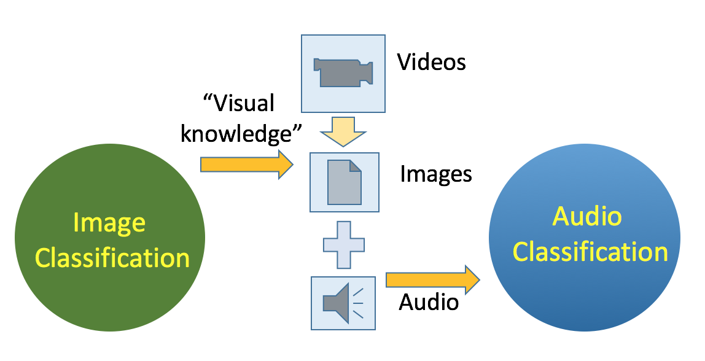
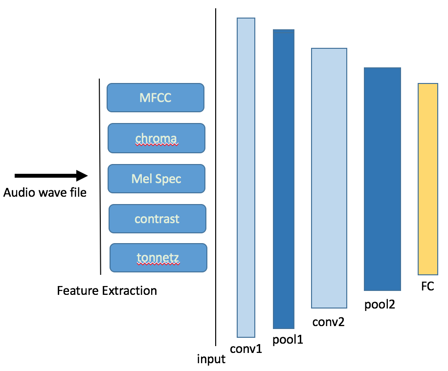
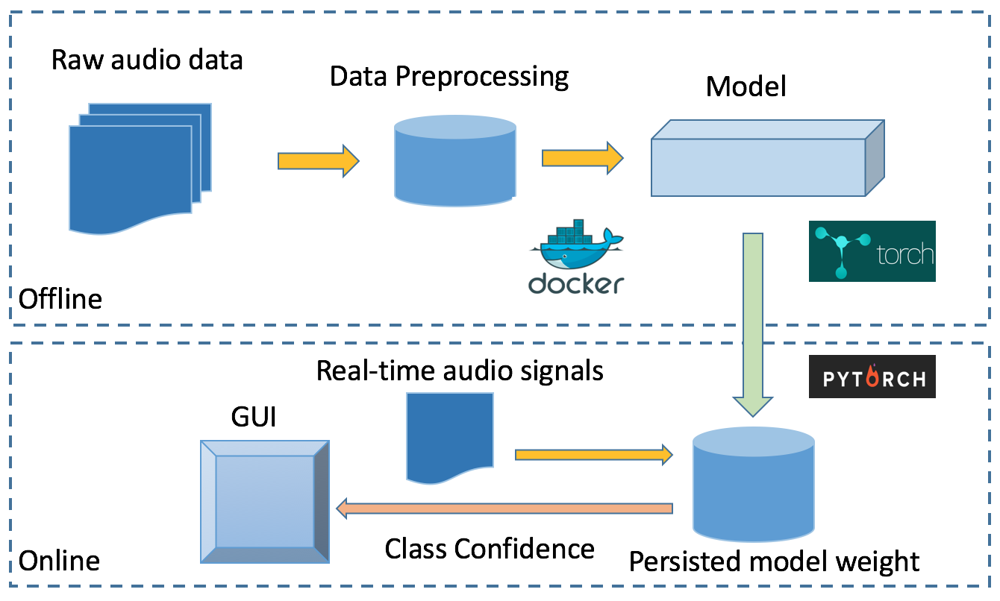

# REDIO
Recognition Events of auDIO: AI project with Insight AI

## Cobalt Robotics | Audio Classification
### Problem 
Cobalt Robotics | Audio Classification | Problem description
Cobalt Robotics is a company focusing on security robotics. This project is aiming to help them to integrate audio detection with their current object detection technologies for improving the sensitivity of their robotics detection system.

### Description of data 
To tackle this problem, I finally chose two public data resources, ESC50 [link]() and UrbanSound8K [link]().  There is an alternative data set in a very large scale, AudioSet, which is released by Google ealy this year. The reason I did not choose it is that the data set did not include their raw audio data because of youtube's license. The data set only includes extracted frames from the raw data by the team, which means we could not work on new data without their feature extraction methods. But if we can use the team's pretrained network to extract features. 

### Results
The best result I got during the four-week-long project was using transfer learning. 
The idea is to use "visual knowledge" from pre-trained image classification network, like VGG [1] to do a cross modality learning on audio data. The idea is shown as following. 

### Method

#### Supervised Learning

#### Transfer Learning

### Pipelines

### Results

##### Prior Work 
Previous initial work done to classify general audio anomalies, including doing some feature extraction from audio data. 

##### Deliverable 
We would like a model that can classify a 1 second audio clip in real time. Our robot runs a full linux desktop environment with a GPU. Implementations in python would be easiest to integrate. We would also like the full training pipeline so that we can retrain the model as we collect more data. There are some prior works doing music classification in Keras: https://keras.io/applications/#musictaggercrnn. 

How Cobalt Robotics would implement the result If we agree that the model is reasonable we will integrate it into our code and deploy it onto all of our robots.

### Reference
[1] SoundNet: Learning Sound Representations from Unlabeled Video : By Yusuf Aytar, Carl Vondrick, Antonio Torralba. NIPS 2016

